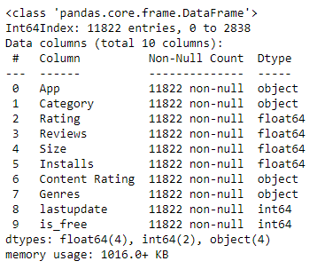
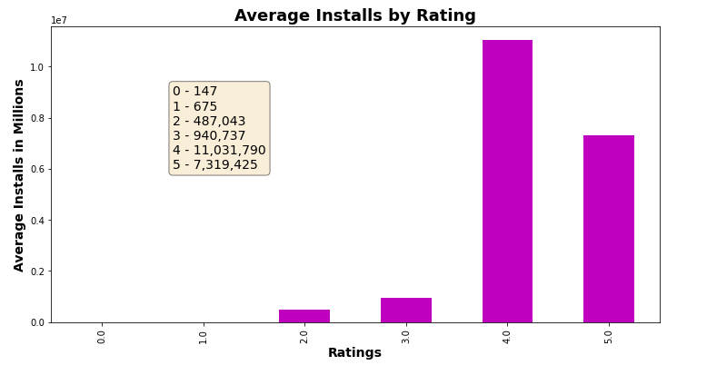
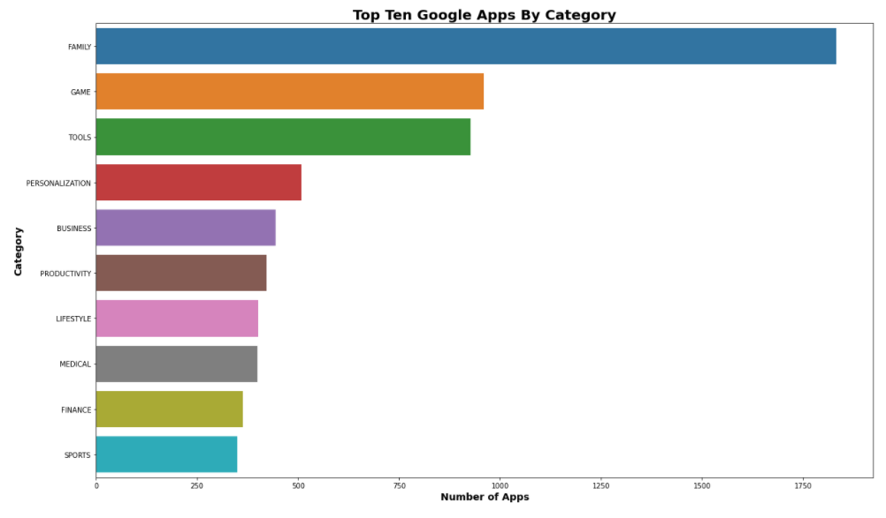
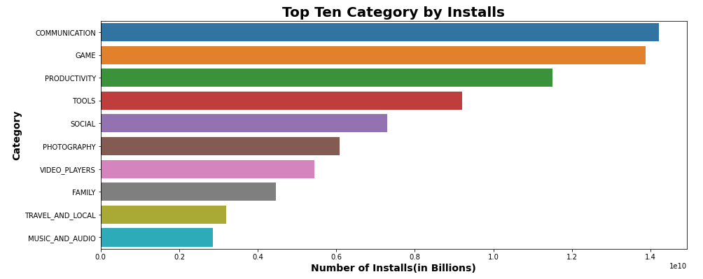
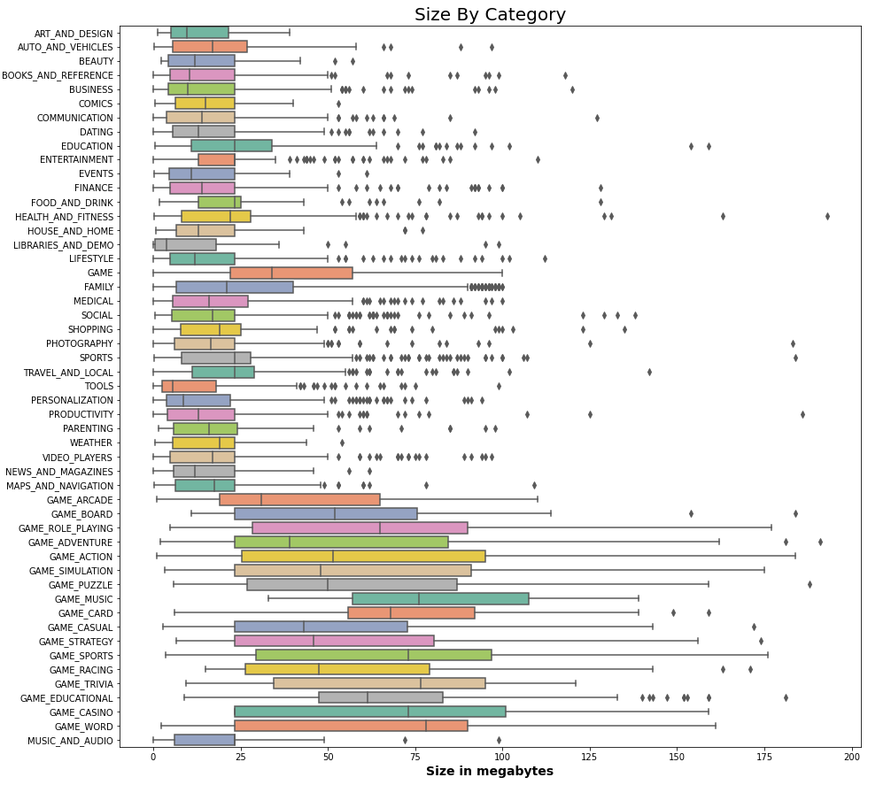
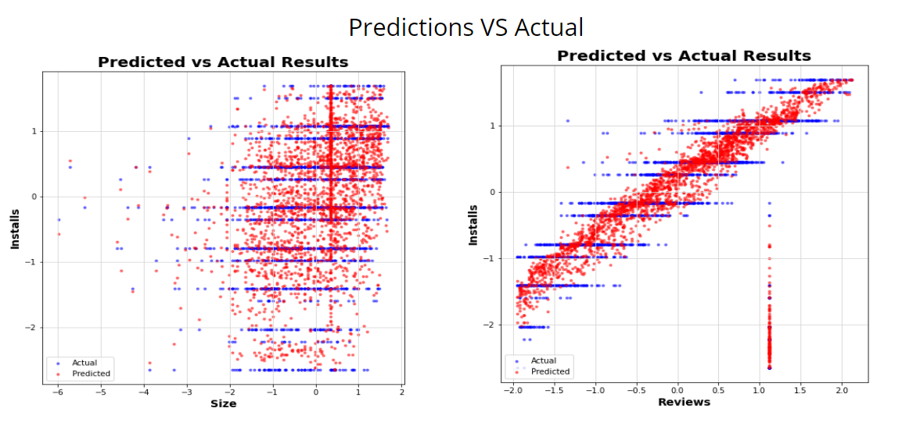
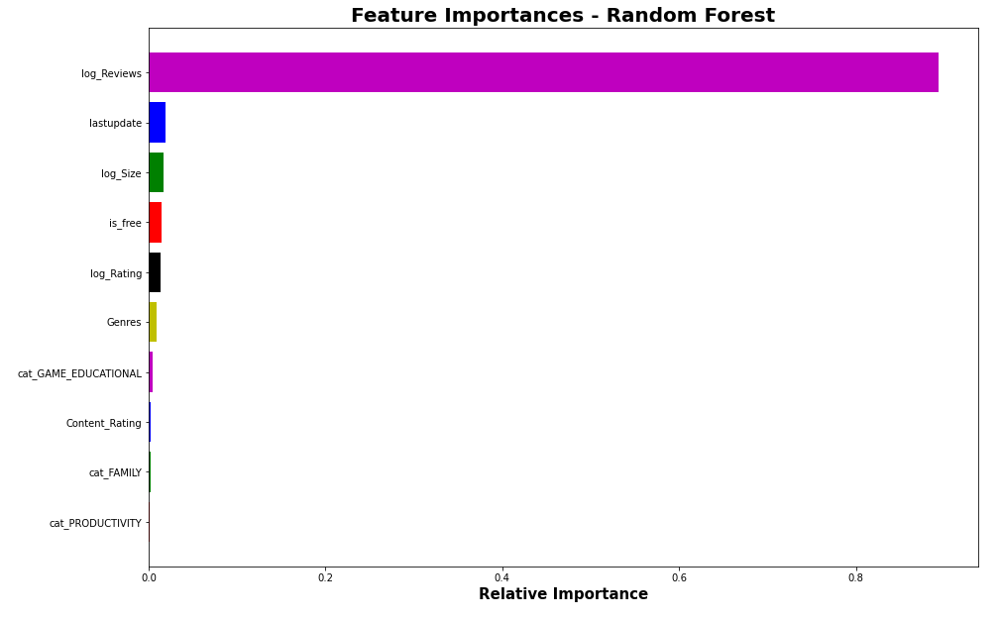

# App Developer For The App Market

The mobile app industry has a value at 100 billion dollars and projected to grow 4 times by 2026. Everyone is flocking to create apps and take a bite out of this statistic. The major factors driving the growth of the market are the increase in devices and the rise in customer base for the e-commerce industry. The fuel of the market is affected by the continuous growth in apps specifically focused on health and fitness, communication, social, and gaming apps. To make a profit, some apps are free to download and only require consumers, if they want, to purchase in-app products.

# Data

Data was obtained from a data set on Kaggle and web scraping:
* **Kaggle** - https://www.kaggle.com/lava18/google-play-store-apps - this dataset gave me access to about **10.8k** data points. 

* **Google Play Store** - https://play.google.com/store?hl=en_US&gl=US - this dataset added about **2800k** data points.

I used google play scraper which is a node.js module that scrapes application data from the Google Play Store. Before cleaning I have over **13.6k** data points, and after cleaning I ended up with **11.8k** data points.



# Business Problem

As a new developer, it is easy to download an app onto the google play store. With an one time fee of $25 you can upload as many free apps as you want. Since about 3700 apps are releases daily, it's important to figure out what will make your apps stand out. Let's focus on what can contribute to the increase of installs on a specific app. Build a model that can determine the relationships between different features and the number of installs. **How can developers make their apps more popular on Google App Store?**

# Key Insights

## What is the relationship between ratings and the number of installs?

While navigating the app store you will notice some curated lists like popular apps, top-rated, top-sellers, etc. Some of these list are curated by looking into an app's ratings, installs, etc. So the higher an app's rating or installs might increase it's chances of being on one of those list.



With the current data and graph above you can see that majority of the apps with high installs have a rating of 4 or more. Consumers tend to gravitate toward apps that have higher ratings. **So as an developer is relevent to keep your app rating betweeen 4 and 5, for a better chance of increasing the amount of installs your app gets.**

## Which category has the most apps?

When looking to create apps it's best to research what people want and who to target. Looking at the graph below we can see that apps that are focused on families dominate the amount of apps available.



This is understandable since families tend to mean more than 2, and some with kids. Parents tend to let kids borrow their phones so not only do they have apps for themselves but they will download apps for their kids as well. Nowadays kids under 13 are getting more involved with technology from Leap Frog pads to owning their own phones/tablets. With guidelines, kids can download games specifically made for them, Family being one of the more popular categories.

## Which category should we focus on by installs?

Knowing that apps are made daily, it's best to narrow down what kind of apps to focus on. Before we focus on what apps are more present on the app store, now let's focus on **which category gets the most downloads**. 



**Communication** has the highest number of installs with **Games** coming quite close in second. Comparing both graphs above there are some similarities. One being that games fell in second, meaning that games are not only high in downloads but also in creating. We also see that tools came in the first five on both graphs as well. This category includes apps that can boost your phone's performance and/or help your phone perform certain tasks like google translate and scanning QR codes, etc.

## What size should an app be?

When researching for an app to download, one of the most important question: **Do I have enough space on my phone?** Most users don't feel inclined to download an app that takes up too much space on their device. So when creating an app it's best to considered how much space you want to take up.



**Size is a great predictor for Installs. Majority of the apps installed are no more than 200 megabytes in size. This shows that size does matter. Most consumers don't want to download apps that takes up too much space on their device storage.  Moreover, Google only permits apps that are less than 500mb. You can still upload a bigger app but it will be broken into two parts.**

# Recommendations

## How good was the final model?
**Random Forest Regressor is the final model with the best accuracy of 90.3% for this problem. Looking at both of these figures, the predicted prices (red dots) coincide with the actual values(blue dots). It's not perfect but it's great start.**



## Features Importance
**This graphs shows the feature importance of this particular model. This technique assign a score to features based on how important they are to predicting a target variable.**



Based on the model recommendations:
1. **Reviews** are crucial to getting more installs. Since word of mouth is very powerful when marketing a product, it's best to focus on getting as many people talking about your products. 
2. **Updating** can lead to getting more people to stay with your app. Updates can help with fixes and bugs that an app might have, and people seem to love when an app has been updated recently. 'Out with the old, in with the new'.
3. **Size** can affect if people have the necessary room to house your app. Though having a large size can represent having more content, it can possibly affect the performance on some platforms.
4. **Price** can affect if a person will download an app. Consumers will most likely see if they can get a free app over a paid app. 
5. **Rating** can be a factor if an app is rated higher than the other. Higher ratings tend to mean the app is good. It also affects the ranking of an app in the app store.

Looking over all the data, I've found a few recommendations for the new developer:
1. **Find a way to market your app. It is a great way to get more installs which can lead to more reviews. If those reviews happen to be positive it can increase the chances of new consumers noticing/downloading your app.**
2. **Updates - Keep your app updated and free of pesky bugs. Keep fresh and new content.** 
3. **When creating an app, it's best to research and see what category is popular in the market. So focusing on family and gaming apps could be boost the amount of installs and create a buzz for your company. However, if we're interested in getting more installs we could focus on communications apps since that's the main reason of having a phone in the first place.**
4. **When creating apps, it best to manage the size of the app. Keeping the app under 200 megabytes, let's the consumer know that your app has substance but it won't take up too much of their device stoarge.**


```python

```
